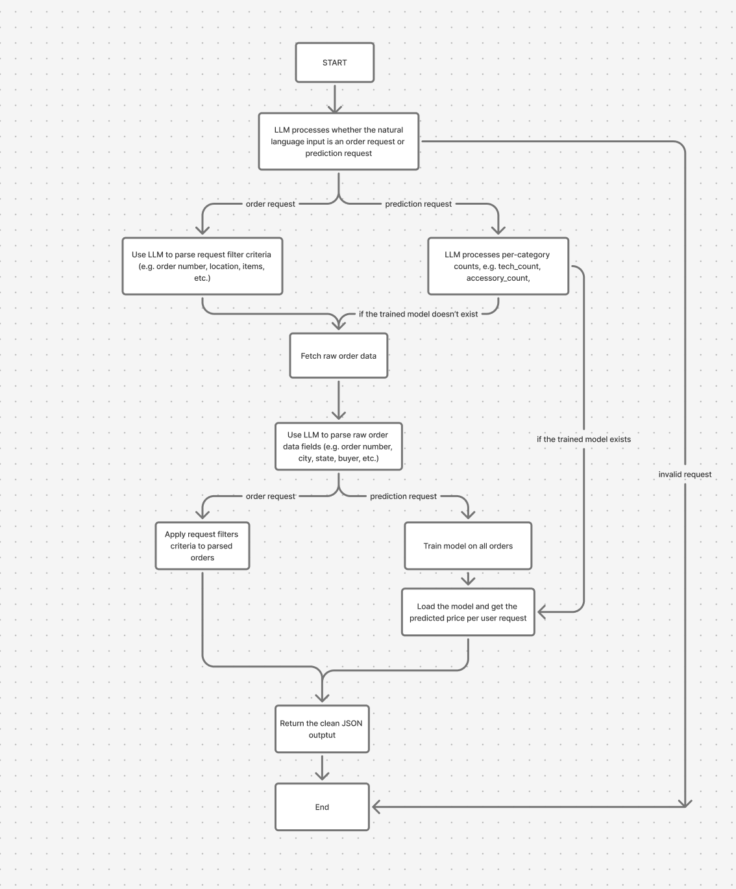

# Customer Order Agent

A LangGraph-based extraction agent that translates natural-language queries into structured order data. Given a natural-language request (e.g. “Show me all orders where the buyer was located in Ohio and total value was over 500.”), the agent calls a customer API to fetch raw data, structures and parses it into typed objects, and returns a clean JSON output.

## Quick start

**Prerequisites:** Python 3.10+, Node 18+, an OpenRouter API key.

```bash
# 1. Set up environment
cp .env.example .env
# Edit .env and add your OPENROUTER_API_KEY

# 2. Install dependencies (Python + frontend)
npm install

# 3. Run everything with one command
npm start
```

## Example commands
```bash
# Filter by state and price (combined filters)
> Show me all orders in Ohio over $500
# Filter by buyer name
> Show me orders from Rachel Kim
# Filter by item
> Which orders have a laptop?
# Single order lookup
> Show me order 1001
# Limit results
> Show me 2 orders
# Get two random orders from the database
> Predict the price of an order with 2 tech, 1 audio
# Access prediction model
```

## Architecture





The agent is built as a LangGraph state machine. Upon parsing the input and determining whether its an order query, prediction query, or validation query it traverses down the state machine accordingly.


## File structure

```
├── main.py                    # LangGraph agent (nodes, state, graph)
├── api.py                     # FastAPI wrapper exposing the agent to the frontend
├── dummy_customer_api.py      # Dummy customer API 
├── frontend/                  # React + Vite + Tailwind chat UI
│   ├── index.html
│   ├── package.json
│   ├── vite.config.ts
│   └── src/
│       ├── main.tsx
│       ├── App.tsx
│       ├── components/        # Chat UI components
│       ├── interfaces/        # Shared TypeScript types
│       └── assets/
├── package.json               # Root scripts: `npm start` runs the whole stack
├── requirements.txt           # Python dependencies
├── .env.example
├── architecture.png
└── README.md
```

---

## Tech stack

- LangGraph for agent orchestration (state machine with typed nodes)
- LangChain (ChatOpenAI) for the OpenRouter-compatible LLM interface
- Pydantic for schema definition and validation
- Python's requests for the HTTP client
- python-dotenv for environment variable management
- Model: openai/gpt-oss-120b:exacto